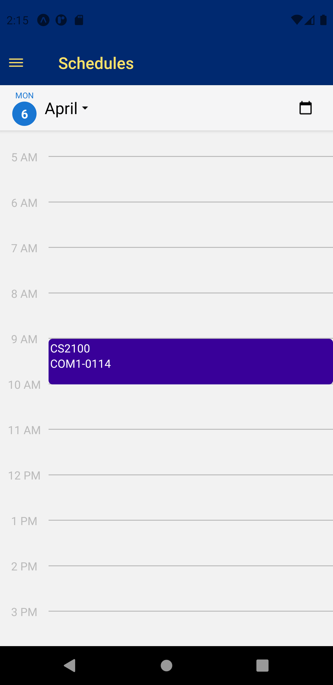

# Fluminus Mobile App

Proposed Level of achievement: Gemini

Mobile client for the Luminus app made for Orbital.

Made in React Native, with a [flask backend server](https://github.com/Orbital-2020-RS-25/pyfluminus-server) hosted on Heroku. 

Work in progress.

## Motivation

Luminus is one of the essential platforms for all National University of Singapore (NUS) personnel. It allows students to access their classes and their relevant information, such as announcement, lecture files, and reminders of events.  Our team identified two drawbacks that we believe there exists room for improvement - 1. lack of clarity on upcoming important events, such as due dates, and 2. the lag users experience when a large number of students sign on at once.

To tackle the identified problems, we defined clear expectations for our proposed solution; the product must be intuitive, and fast.  Intuitive so that users can easily view the information they require(such as test dates), and fast to reduce user frustration. Mobile phones will be our platform of choice as we believe crucial information such as test timings should always be within an arm's reach at any point in time.

Although there is a pre-existing APP for Luminus, its' UI is cluttered, and navigation is tedious. The APP also lacks basic features such as a file management system, making it even harder to use the APP. Thus there is merit in our solution to improve the convenience of NUS students.

## Demos

 

 

## App flow

## Tech stack

### Front-end
* [React-Native](https://reactnative.dev/ "React-Native")
* [Expo](https://expo.io/ "Expo")

### Back-end
* [Flask](https://flask.palletsprojects.com/en/1.1.x/ "Flask documentation")
* [Flask-sqlalchemy](https://flask-sqlalchemy.palletsprojects.com/en/2.x/ "Documentation")

### Database
* [PostreSQL](https://www.postgresql.org/ "PostreSQL")

### Hosting
* Heroku

This project relies on [Pyfluminus](https://github.com/raynoldng/pyfluminus) for communications with FlumiNUS, and [NUSMods API](https://api.nusmods.com/v2/) for timetable information.

## Features

S/N | Feature | Function | Achieved
--- | ------- | --------- | --------
1 | Login | Able to login to user account | ✅
2 | Schedule | Able to look at schedule to see upcomming events/ tests/ etc. | ✅
3 | Module info | Able to select modules and get relevant information (files, announcements). | ✅
4 | Push notification | Able to send push notification for important events (eg. assignment due date). | ❌
5 | Persistent login | Able to set login once and forget feature | ❌

Legend:
✅ - Done
❌ - Under review / Not done

Click [here](https://app.swaggerhub.com/apis-docs/orbital-rs25/another-luminus/) for the API reference.

## Problems encountered

* Lack of proper data for testing
  * As it is summer break now, we don't have any active modules on LumiNUS (Special Term II mods are properly mounted as active mods)
  * The current data that we use for testing are retrieved from CS2100 (which was closed only at a later date), and OTH633 (non-academic, RC4 student life matters, never closed)
  * We saved the data we could retrieve in our database, and though we did prepare functions for getting such information from LumiNUS, we rely heavily on alternative functions that get pre-collected data from our own database instead (though the proper functions were also tested and were used for the initial collection of data, and they have the same function signatures as the alternative ones, so they can be swapped easily)
* Problems with Jest with attempting to write tests
  * We tried to make Jest work with ES6 'import/export' statements but to no avail
  * We will continue to look into workarounds for this or switch to other testing frameworks

## Software Engineering

| Type | Description |
| --- | --- |
| Source control | We practised source control for our code through git, with major changes or additions made on new branches that are subsequently merged to master branch only if they work and we both agree on the changes or additions |
| Abstraction | With the cilent-server model, data from LumiNUS and NUSMods are processed on the server into nice chunks of JSON that follow a standard format, allowing the cilent to access the needed data easily. |
| Separation of concerns | Screens do not depend on each other and are focused on doing a single task, so modifiying one page would not affect the functions of other pages. |
| UI | Designed to make it simple to navigate through, with all the information easily accessible. Announcements and files are designed to resemble how they are presented on web LumiNUS to make it feel more intuitive to use. |

## Tests

Manual testing has been done with our actual LumiNUS accounts to ensure authentication and backend functions are working, and both real and demo accounts were used to test and ensure that the mobile client is functional.
